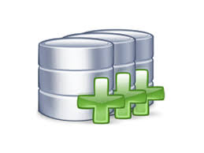

# multidatabase
A Multidatabase Project for ITCR Course Bases Datos II

 API Description

# 

Sistema Multidatabase para conexiones y consultas a multiples servidores de BD.


## Instalacion

```
Descargue el proyecto y ábralo en Visual Studio 2015
Podrá encontrar el ejecutable de la solucion VS, 

Multidatabase/Proyecto Multidatabase.sln

```

## Requerimientos

```Instalaciones

#Mongo : 


```

## API

### Multidatabase([API])

#### API

##### rutas

El proyeco del servicio expone las siguientes funciones, cada una de ellas recibe su lista de parámetros
por medio de JSON

##### /includeDB
       Paráms: 
		string db_type: Tipo de servidor al que queremos conectarnos. Ej.(MariaDB,SQLDB,MongoDB)  
		string username : Usuario Autorizado de la Base de Datos . Ej. (root)
		string pass   : Contraseña del Usuario de la Base de Datos ---
		string server : Servidor donde se encuentra alojada. Ej. (localhost) 
		string protocol : Protocolo de comunicacion que utiliza el servidor. Ej( TCp/IP , MySQL/TCP )
		int port: Puerto principal donde esta corriendo el servidor . Ej. (27017,1440,3306) 
		string alias : Nombre adjunto a esta conexión.

       JSON  : { "db_type" : "SQLDB" , "username": "root" , ... }

##### /createDB

##### /createTable

##### /deleteTable

##### /multipleQuery

##### /insertValuesTable

##### /updateValuesTable

##### /multipleQuery

##### /getConecctions


## Team

[](https://aallanrd.com) | [](https://github.com/carg62) | [](https://github.com/Gerardo)
---|---|---
[Allan RD](https://aallanrd.com) | [Carlos Arguello](https://github.com/carg62) | [Gerardo Villalobos](https://github.com/gera)


## License

GPL © [General Public License](https://github.com/aallanrd/multidatabase/License)
